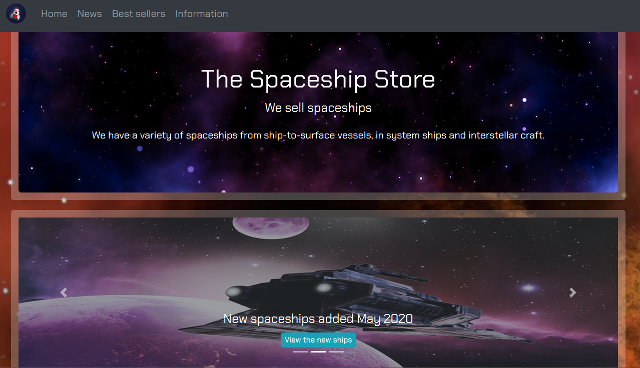

# The Spaceship Store
> A landing page for a company called The Spaceship Store.

## Table of contents
* [General info](#general-info)
* [Screenshots](#screenshots)
* [Technologies](#technologies)
* [Setup](#setup)
* [Status](#status)
* [Inspiration](#inspiration)
* [Contact](#contact)

## General info
I wanted to try using Bootstrap and thought the idea of a shop selling spaceships was amusing. It also meant I got to have some fun coming up with descriptions of the ships and coming up with an appropriately sci-fi address.

## Screenshots

## Technologies
* HTML
* Bootstrap 4

## Setup
To view this project visit the [demo](https://spaceshipstore.netlify.com/) or download the files and open index.html

## Status
Project is: _finished_

## Inspiration
Star Trek, Star Wars, Galaxy Quest, Red Dwarf and Doctor Who, whose ships I featured.

## Contact
Created by [nicm42](https://www.twitter.com/nicm4242) - feel free to contact me!
